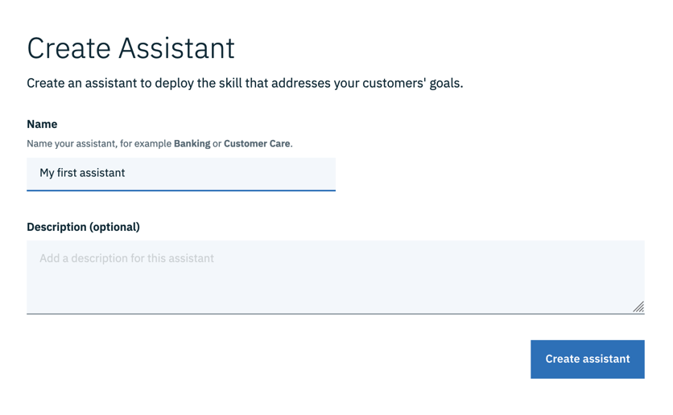
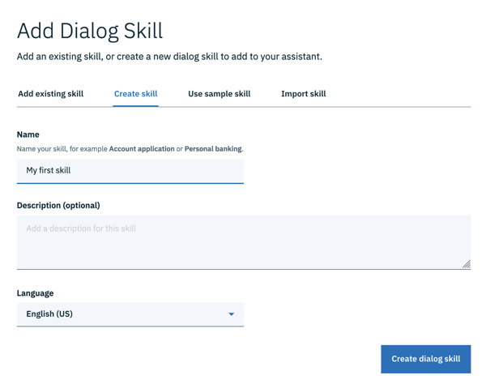
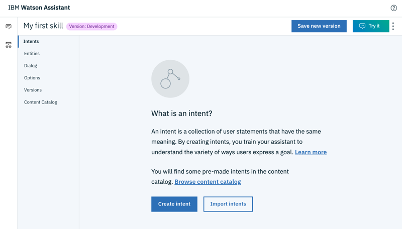
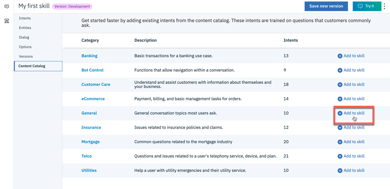
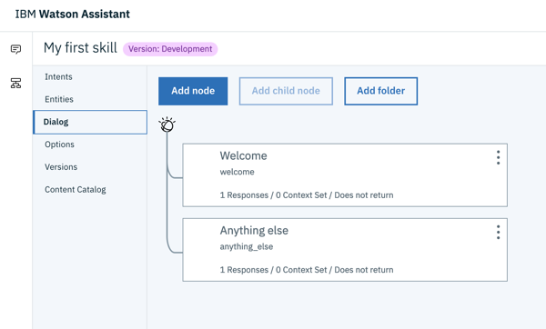
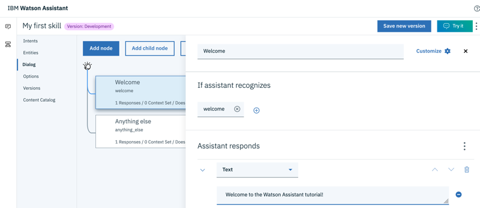
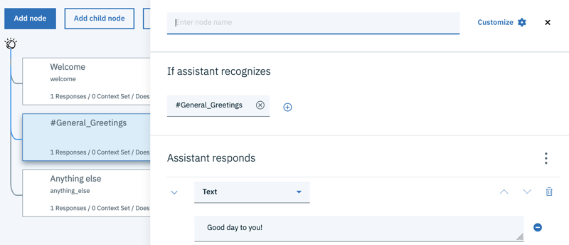
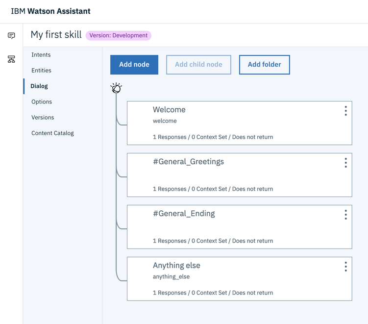

---

copyright:
  years: 2015, 2019
lastupdated: "2019-12-03"

subcollection: assistant-data

---

{:shortdesc: .shortdesc}
{:new_window: target="_blank"}
{:external: target="_blank" .external}
{:deprecated: .deprecated}
{:important: .important}
{:note: .note}
{:tip: .tip}
{:pre: .pre}
{:codeblock: .codeblock}
{:screen: .screen}
{:javascript: .ph data-hd-programlang='javascript'}
{:java: .ph data-hd-programlang='java'}
{:python: .ph data-hd-programlang='python'}
{:swift: .ph data-hd-programlang='swift'}
{:hide-dashboard: .hide-dashboard}
{:download: .download}
{:gif: data-image-type='gif'}

# Getting started with {{site.data.keyword.conversationshort}}
{: #getting-started}

In this short tutorial, we introduce {{site.data.keyword.conversationfull}} and walk you through the process of creating your first assistant.
{: shortdesc}

## Before you begin
{: #before-you-begin}

1. Provision an instance of the {{site.data.keyword.conversationshort}} for {{site.data.keyword.icp4dfull}} service. For more information about provisioning, see [Installing](/docs/services/assistant-data?topic=assistant-data-install).

## Step 1: Open Watson Assistant
{: #getting-started-launch-tool}

1.  From the {{site.data.keyword.icp4dfull_notm}} web client menu, choose **My Instances**.

1.  On the **Provisioned instances** tab, find your {{site.data.keyword.conversationshort}} instance, and then hover over the last column to show and click the ellipsis icon .
1.  Choose **View details**.
1.  Click **Open {{site.data.keyword.conversationshort}}**.

A new browser tab or window opens and {{site.data.keyword.conversationshort}} is displayed.

- An assistant named **My first assistant** is created for you automatically. An *assistant* is a cognitive bot to which you add skills that enable it to interact with your customers in useful ways.

- A dialog skill named **My first skill** is added to the assistant for you automatically. A *dialog skill* is a container for the artifacts that define the flow of a conversation that your assistant can have with your customers.

If an assistant and skill are not created automatically, complete Steps 2 and 3. Otherwise, you can [skip to Step 4: Add intents from a content catalog](#getting-started-add-catalog).

## Step 2: Create an assistant
{: #getting-started-create-assistant}

An *assistant* is a cognitive bot to which you add skills that enable it to interact with your customers in useful ways.

1.  Click the **Assistants** icon , and then click **Create assistant**.

    
1.  Name the assistant `My first assistant`.
1.  Click **Create assistant**.

    

## Step 3: Create a dialog skill
{: #getting-started-add-skill}

A *dialog skill* is a container for the artifacts that define the flow of a conversation that your assistant can have with your customers.

Usually a dialog skill is created for you automatically. If not, complete this step to create your first dialog skill.

1.  Click the *My first assistant* tile to open the assistant.

1.  Click **Add dialog skill**.

    

1.  Give your skill the name `My first skill`.
1.  **Optional**. If the dialog you plan to build will use a language other than English, then choose the appropriate language from the list.

    

1.  Click **Create dialog skill**.

    

1.  Click to open the skill you just created.

## Step 4: Add intents from a content catalog
{: #getting-started-add-catalog}

When you open the *My first skill*, you land on the *Intents* page.

Add training data that was built by IBM to your skill by adding intents from a content catalog. In particular, you will give your assistant access to the **General** content catalog so your dialog can greet users, and end conversations with them.

1.  From the skill menu, click **Content Catalog**.
1.  Find **General** in the list, and then click **Add to skill**.

    
1.  Open the **Intents** tab to review the intents and associated example utterances that were added to your training data. You can recognize them because each intent name begins with the prefix `#General_`. You will add the `#General_Greetings` and `#General_Ending` intents to your dialog in the next step.

    

You successfully started to build your training data by adding prebuilt content from {{site.data.keyword.IBM_notm}}.

## Step 5: Build a dialog
{: #getting-started-build-dialog}

A *dialog* defines the flow of your conversation in the form of a logic tree. It matches intents (what users say) to responses (what the bot says back). Each node of the tree has a condition that triggers it, based on user input.

We'll create a simple dialog that handles greeting and ending intents, each with a single node.

### Adding a start node

1.  From the Skills menu, click **Dialog**.
1.  Two nodes were added to the dialog for you:
    - **Welcome**: Contains a greeting that is displayed to your users when they first engage with the assistant.
    - **Anything else**: Contains phrases that are used to reply to users when their input is not addressed by any of the existing dialog nodes.

    
1.  Click the **Welcome** node to open it in the edit view.
1.  Replace the default response with the text, `Welcome to the Watson Assistant tutorial!`.

    
1.  Click  to close the edit view.

You created a dialog node that is triggered by the `welcome` condition. (`welcome` is a special condition that functions like an intent, but does not begin with a `#`.) It is triggered when a new conversation starts. Your node specifies that when a new conversation starts, the system should respond with the welcome message that you add to the response section of this first node.

### Testing the start node

You can test your dialog at any time to verify the dialog. Let's test it now.

- Click the  icon to open the "Try it out" pane. You should see your welcome message.

### Adding nodes to handle intents

Now let's add nodes between the `Welcome` node and the `Anything else` node that handle our intents.

1.  Click the More icon  on the **Welcome** node, and then select **Add node below**.
1.  In the **If assistant recognizes** field of this node, start to type `#General_Greetings`. Then, select the **`#General_Greetings`** option.
1.  Add the response text, `Good day to you!`

   

1.  Click  to close the edit view.
1.  Click the More icon  on this node, and then select **Add node below** to create a peer node. In the peer node, specify `#General_Ending` in the **If assistant recognizes** field, and `OK. See you later.` as the response text.

1.  Click  to close the edit view.

   

### Testing intent recognition

You built a simple dialog to recognize and respond to both greeting and ending inputs. Let's see how well it works.

1.  Click the  icon to open the "Try it out" pane. There's that reassuring welcome message.
1.  At the bottom of the pane, type `Hello` and press Enter. The output indicates that the `#General_Greetings` intent was recognized, and the appropriate response (`Good day to you.`) is displayed.
1.  Try the following input:
    - `bye`
    - `howdy`
    - `see ya`
    - `good morning`
    - `sayonara`

{: gif}

{{site.data.keyword.watson}} can recognize your intents even when your input doesn't exactly match the examples that you included. The dialog uses intents to identify the purpose of the user's input regardless of the precise wording used, and then responds in the way you specify.

### Result of building a dialog

That's it. You created a simple conversation with two intents and a dialog to recognize them.

## Next steps
{: #getting-started-next-steps}

This tutorial is built around a simple example. For a real application, you need to define some more interesting intents, some entities, and a more complex dialog that uses them both. When you have a polished version of the assistant, you can make API calls to it from your client application.

- Complete follow-on tutorials that build more advanced dialogs:
    - Add standard nodes with the [Building a complex dialog](/docs/services/assistant-data?topic=assistant-data-tutorial) tutorial.
    - Learn about slots with the [Adding a node with slots](/docs/services/assistant-data?topic=assistant-data-tutorial-slots) tutorial.
- Check out more [sample apps](/docs/services/assistant-data?topic=assistant-data-sample-apps) to get ideas.