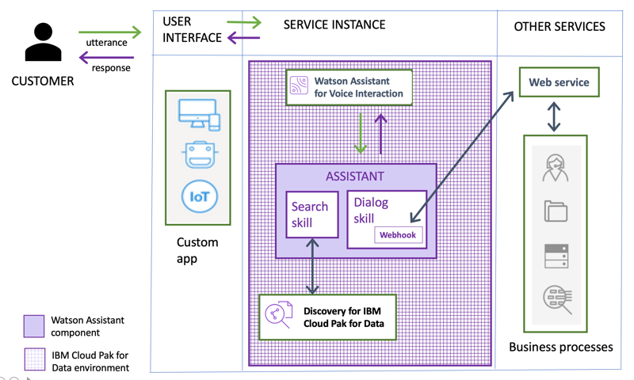

---

copyright:
  years: 2015, 2019
lastupdated: "2019-11-25"

subcollection: assistant-data

---

{:shortdesc: .shortdesc}
{:new_window: target="_blank"}
{:external: target="_blank" .external}
{:deprecated: .deprecated}
{:important: .important}
{:note: .note}
{:tip: .tip}
{:pre: .pre}
{:codeblock: .codeblock}
{:screen: .screen}
{:javascript: .ph data-hd-programlang='javascript'}
{:java: .ph data-hd-programlang='java'}
{:python: .ph data-hd-programlang='python'}
{:swift: .ph data-hd-programlang='swift'}
{:download: .download}
{:gif: data-image-type='gif'}

# About
{: #index}

Use {{site.data.keyword.conversationfull}} for {{site.data.keyword.icp4dfull}} to build your own branded assistant into any device, application, or channel. Connect your assistant to the customer engagement resources you already use to deliver an engaging, unified problem-solving experience to your customers.
{: shortdesc}

## How it works
{: #index-how-it-works}

This diagram illustrates how the product delivers an omnichannel customer experience:

- Users interact with your application through the **custom client user interface** that you implement. For example, a simple chat window or a mobile app, or even a robot with a voice interface. The client application can be hosted either inside or outside the {{site.data.keyword.icp4dfull_notm}} infrastructure.

- Your application can interact with the following resources:

    - **Other IBM services**: Connect with additional {{site.data.keyword.watson}} services to analyze user input, such as {{site.data.keyword.toneanalyzershort}} or {{site.data.keyword.speechtotextshort}}.
    - **Back-end systems**: Based on the user's intent and additional information, extract information or perform transactions by interacting with your back-end systems. For example, answer question, open tickets, update account information, or place orders.

- The **assistant** receives user input and routes it to the appropriate skill.

  - The **dialog skill** interprets the user input further, then directs the flow of the conversation. The dialog gathers any information it needs to respond or perform a transaction on the user's behalf.

  - The **search skill** routes complex customer inquiries to {{site.data.keyword.discoveryfull}} for {{site.data.keyword.icp4dfull}}. {{site.data.keyword.discoveryshort}} treats the user input as a search query. It finds information that is relevant to the query from the configured data sources and returns it so the assistant can share the information with the user as its response.

The tool does not currently include integrations for deploying the finished assistant nor metrics for analyzing conversations that your assistant is having with your users. Such deployment and metrics features are available from the public cloud version of the service only.

You can integrate your assistant with the Watson Assistant for Voice Interaction service. For more details, see [Watson Assistant for Voice Interaction](https://www.ibm.com/support/knowledgecenter/SSQNUZ_2.5.0/svc-wavi/wavi-overview.html){: external}.
{: tip}

## Implementation
{: #index-implementation}

This diagram shows the implementation in more detail:

Here's how you implement your assistant:

- **Create an assistant**.

- **Create a dialog skill**. Use the intuitive graphical tool to define the training data and dialog for the conversation between your assistant and your customers.

  The training data consists of the following artifacts:

  - **Intents**: Goals that you anticipate your users have when they interact with your assistant. Define one intent for each goal that can be identified in a user's input. For example, you might define an intent that is named *store_hours* that answers questions about store hours. For each intent, you add sample utterances that reflect the input customers might use to ask for the information they need, such as, `What time do you open?`

    Or use prebuilt **content catalogs** that are provided by IBM to get started with data that addresses common customer goals.

  - **Dialog**: Use the dialog tool to build a dialog flow that incorporates your intents. The dialog flow is represented graphically in the tool as a tree. You can add a branch to process each of the intents that you want your assistant to handle.

  - **Entities**: An entity represents a term or object that provides context for an intent. For example, an entity might be a city name that helps your dialog to distinguish which store the user wants to know store hours for. After you add entities, update your dialog to use them. Add dialog nodes that handle the many possible permutations of a request based on the entities that are found in the user input.

    As you add training data, a natural language classifier is automatically added to the skill. The classifier model is trained to understand the types of requests that you teach your assistant to listen for and respond to.

- **Create a search skill** Configure a connection to a {{site.data.keyword.discoveryshort}} instance. If the dialog is configured to perform a search or is not designed to answer a particular type of question, the assistant searches the configured external data sources to find a response.

- **Add the skills to your assistant.**

- **Deploy your assistant.** Deploy the assistant to users by connecting it to a front-end user interface that you build.

Read more about these steps by following these links:

- [Intent creation overview](/docs/services/assistant-data?topic=assistant-data-intents#intents-described)
- [Dialog overview](/docs/services/assistant-data?topic=assistant-data-dialog-overview)
- [Entity creation overview](/docs/services/assistant-data?topic=assistant-data-entities#entities-described)
- [Assistant overview](/docs/services/assistant-data?topic=assistant-data-assistant-add)
- [Building a client application](/docs/services/assistant-data?topic=assistant-data-api-client)

## Browser support
{: #index-browser-support}

The {{site.data.keyword.conversationshort}} for {{site.data.keyword.icp4dfull_notm}} product user interface requires the same level of browser software as is required by {{site.data.keyword.icp4dfull_notm}}. For details, see [Browser requirements](https://www.ibm.com/support/knowledgecenter/SSQNUZ_2.5.0/cpd/plan/rhos-reqs.html#rhos-reqs__web){: external}.

## Language support
{: #index-language-support}

Language support by feature is detailed in the [Supported languages](/docs/services/assistant-data?topic=assistant-data-language-support) topic.

## Security
{: #index-security}

Federal Information Security Management Act (FISMA) support is available for {{site.data.keyword.conversationshort}} for {{site.data.keyword.icp4dfull_notm}} offerings purchased on or after 30 August 2019. {{site.data.keyword.conversationshort}} for {{site.data.keyword.icp4dfull_notm}} is FISMA High Ready.

## Next steps
{: #index-next-steps}

- [Get started](/docs/services/assistant-data?topic=assistant-data-getting-started) with the service
- Try out some [demos](/docs/services/assistant-data?topic=assistant-data-sample-apps).
- View the list of [developer resources](https://www.ibm.com/watson/developer-resources/){: external}.

Still have questions? Contact [IBM Sales](https://www-01.ibm.com/marketing/iwm/dre/signup?source=urx-20970){: external}.

## Trademarks
{: index-trademarks}

IBM, the IBM logo, and ibm.com are trademarks or registered trademarks of International Business Machines Corp., registered in many jurisdictions worldwide. Other product and service names might be trademarks of IBM or other companies. A current list of IBM trademarks is available on the web at [Copyright and trademark information](www.ibm.com/legal/copytrade.shtml){: external}.

Java and all Java-based trademarks and logos are trademarks or registered trademarks of Oracle and/or its affiliates.

