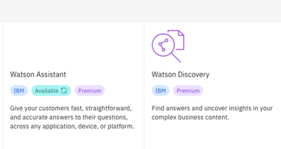

---

copyright:
  years: 2015, 2021
lastupdated: "2021-03-19"

subcollection: assistant-data

---

{:shortdesc: .shortdesc}
{:new_window: target="_blank"}
{:external: target="_blank" .external}
{:deprecated: .deprecated}
{:important: .important}
{:note: .note}
{:tip: .tip}
{:pre: .pre}
{:codeblock: .codeblock}
{:screen: .screen}
{:javascript: .ph data-hd-programlang='javascript'}
{:java: .ph data-hd-programlang='java'}
{:python: .ph data-hd-programlang='python'}
{:swift: .ph data-hd-programlang='swift'}

# Troubleshooting
{: #troubleshoot}

Get help with solving issues that you encounter while using the product.
{: shortdesc}

## 1.5.0 
{: #troubleshoot-150}

### Delete the pdb (poddisruptionbudgets) when changing instance from medium to small
{: #troubleshoot-delete-pdb}
Whenever the size of Watson Assistant is changed from medium to small, a manual step is required to delete the `poddisruptionbudgets` that are created for medium instances.

Run the following command, replacing `<instance-name>` with the name of your Watson Assistant CR instance and replacing `<namespace-name>` with the name of the namespace where the instance resides.

```
oc delete pdb  -l icpdsupport/addOnId=assistant,component!=etcd,ibmevents.ibm.com/kind!=Kafka,app.kubernetes.io/instance=<instance-name> -n <namespace-name>

```

## 1.4.2 
{: #troubleshoot-142}

### Cannot provision an instance, and service images are missing from the catalog
{: #troubleshoot-142-missing-label}

If you run the installation with no errors, but cannot provision an instance, check whether the product icon is visible in the service tile. From the {{site.data.keyword.icp4dfull_notm}} web client, go to the *Services* page. 

  

1.  Find the {{site.data.keyword.conversationshort}} service tile. Check whether the product logo () is displayed on the tile. 

    

1.  If the logo is missing, it is likely that you missed the step in the installation process where you label the namespace.

    - **3.0.1**: See [Step 4: Add the cluster namespace label to your service namespace](/docs/assistant-data?topic=assistant-data-install-142#install-142-cpd30-apply-namespace-label).
    - **2.5**: See: [Step 4: Add the cluster namespace label to your service namespace](/docs/assistant-data?topic=assistant-data-install-142#install-142-cpd25-apply-namespace-label).

### Getting an error when using v2 `/message` API
{: #troubleshoot-142-v2-error}
<!--issue 44398-->

- Problem: When calling the [`/message` v2 API](https://cloud.ibm.com/apidocs/assistant-data-v2#message){: external} to send user input to your assistant, the following error is returned: `Unable to query assistant metadata`.
- Cause: A database race condition occurs when too many Postgres heartbeat calls are sent.
- Solution: To resolve the issue, turn off the `DB_USE_HEARTBEAT` environment setting on the store pods.
  
  You can use the following command to change the setting:

  ```
  oc set env deploy watson-assistant-store DB_USE_HEARTBEAT=false
  ```
  {: codeblock}

### Getting an error when importing a skill
{: #troubleshoot-142-import-error}
<!--issue 44309-->

- Problem: An error is displayed when importing a skill that was exported from a different environment, where both environments are running {{site.data.keyword.conversationshort}} for {{site.data.keyword.icp4dfull_notm}} 1.4.2. The error says, `Error - Internal`.
- Cause: The new environment does not have enough memory dedicated to the keeper pods. For example, the new environment sets the keeper pod memory setting to 256 MB, but the development environment that the skill is being exported from sets the keeper pod memory setting to 1 Gi.
- Solution: Increase the keeper pod memory in the environment where the skill is being imported to match that of the environment from which the skill is being exported.